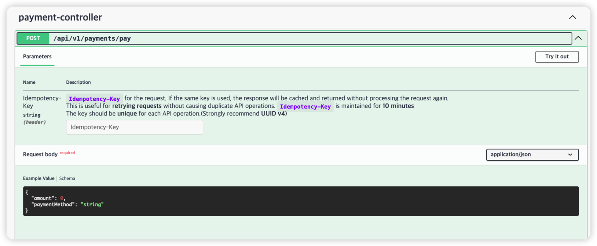
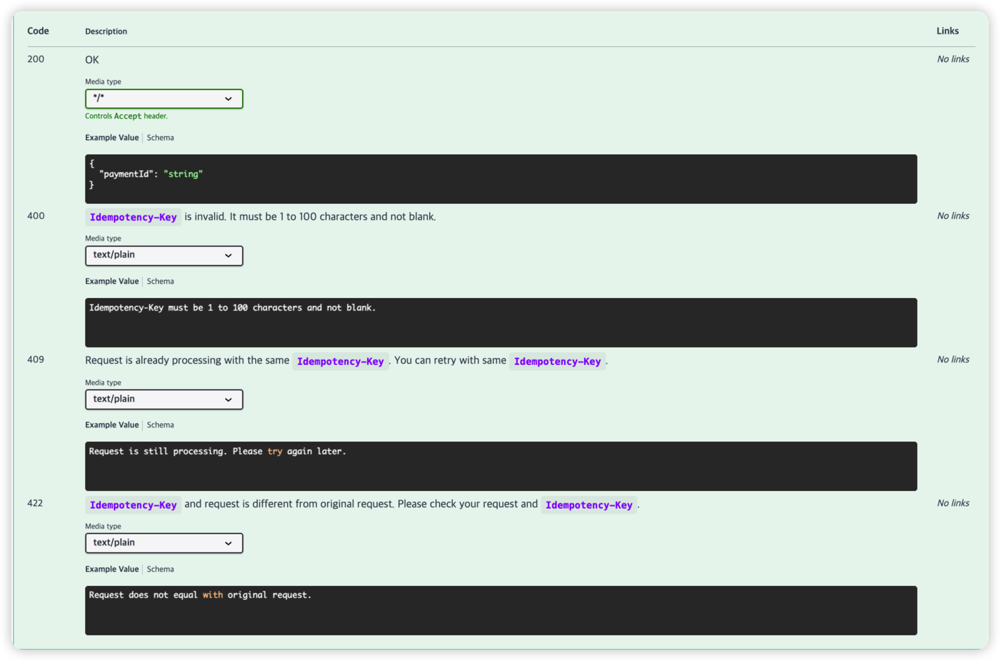

# Spring Idempotency

## English

### Overview
This project demonstrates **HTTP idempotency** for Spring WebMvc by caching request/response pairs in **Redis**.
It provides a simple idempotency filter and an annotation-based registry so only explicitly marked endpoints accept the `Idempotency-Key` header.

### Key Features
- **Idempotency-Key header** support with validation (1–100 chars, non-blank)
- **Annotation-based opt-in** (`@IdempotentHttpOperation`) for allowed endpoints
- **Redis-backed storage** with **10-minute TTL** for cached responses
- **Conflict & validation handling** for in-flight or mismatched requests
- **Swagger/OpenAPI annotations** for idempotent operations

### How It Works
1. Client sends a request with `Idempotency-Key`.
2. Filter builds an idempotency ID: `METHOD::PATH::KEY`.
3. If no record exists, the request is processed and the response is cached in Redis.
4. Subsequent requests with the same key return the cached response.
5. If the key is reused with a **different request**, the server returns **422**.
6. If the original request is still processing, the server returns **409**.

### Idempotent Http Endpoints

### Responses

- **400**: invalid `Idempotency-Key` or header used on a non-idempotent endpoint
- **409**: request with same key is still processing
- **422**: request body/metadata does not match the original request

---

## 한국어

### 개요
이 프로젝트는 Spring WebMvc에서 **HTTP 멱등성(Idempotency)** 을 구현하는 예제입니다.
요청/응답을 **Redis**에 캐싱하여 동일한 요청이 중복 처리되지 않도록 합니다.
`@IdempotentHttpOperation` 으로 명시된 엔드포인트만 `Idempotency-Key` 헤더를 허용합니다.

### 주요 기능
- `Idempotency-Key` 헤더 검증 (1–100자, 공백 불가)
- **어노테이션 기반 opt-in** (`@IdempotentHttpOperation`)
- **Redis 저장 + 10분 TTL**
- 처리 중/요청 불일치 시 상태 코드 반환
- Swagger/OpenAPI 어노테이션 포함

### 동작 방식
1. 클라이언트가 `Idempotency-Key` 포함 요청 전송
2. `METHOD::PATH::KEY` 형태로 멱등 키 생성
3. 처음 요청은 처리 후 응답을 Redis에 저장
4. 동일 키로 재요청 시 저장된 응답 반환
5. 동일 키로 **다른 요청**이면 **422** 반환
6. 이전 요청이 아직 처리 중이면 **409** 반환

### 멱등한 Http 엔드포인트

### 응답
- **400**: `Idempotency-Key` 유효하지 않거나 멱등 미적용 엔드포인트에 사용
- **409**: 동일 키 요청이 아직 처리 중
- **422**: 동일 키로 요청이 원본과 다름

